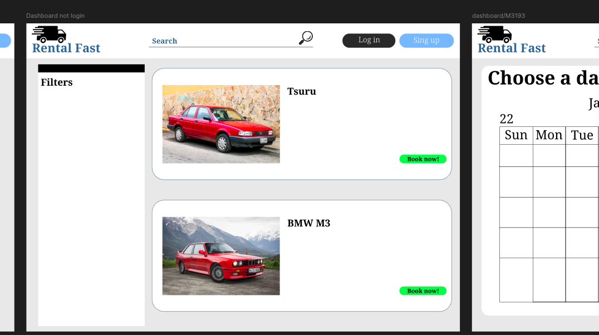
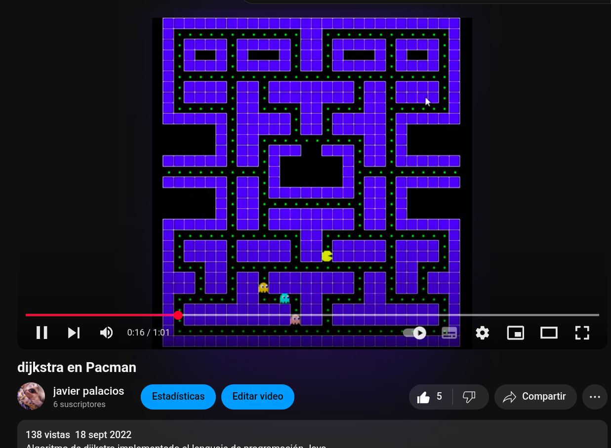
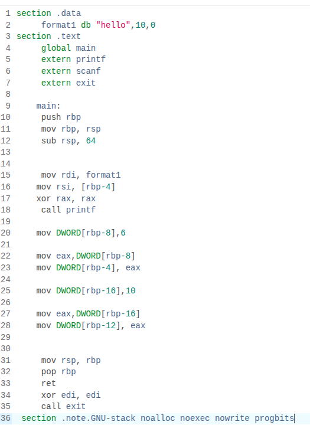
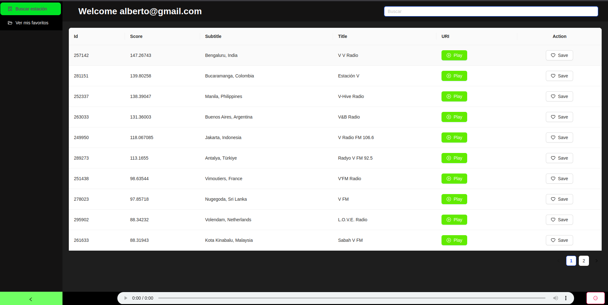

# About me

1. ⭐ Engineer System Computer ⭐
2. 📲 Backend Developer with framework spring boot Java and SQL
3. 🧑‍🏫 Skills in data structure and algorithms
4. ✏️ Development frontend with framework React and JavaScript vanilla

---

# My projects

# Rental-Fast-Alpha: Hexagonal Architecture

This system is built with ***Spring Boot***, and later I will use ***Angular*** to build the frontend. I’m currently working on the backend with Spring Boot.

#### This project is under active development

### if you want see my backend code visit: [Code](https://github.com/JavierAPalaciosL/RentalFast)

### Frontend in progress ...

----

# Pacman using Java Swing and graph theory using Dijkstra's algorithm

### If you want see my code visit           :  [Code](https://github.com/JavierAPalaciosL/Pacman-with-dijkstra-s-algorithm)

### If you want see my youtube video  :  [Video](https://www.youtube.com/watch?v=KiP_vDexrXQ&ab_channel=javierpalacios)

*I use Java Swing using Theory graphs* - Algorithms

----

# Compiler with a custom Language Compiler using JavaCC and x86-64 Assembly

### Code link [Link](https://github.com/JavierAPalaciosL/Compiler)

*Built a custom C-style language compiler using JavaCC and Java to parse source code, then emitted Intel-syntax x86-64 assembly and assembled it with NASM and GCC into a native executable. Explored grammar design, semantic actions, and low-level code generation in a single end-to-end pipeline.*

---

# React and Spring Boot App consumming an API

### Frontend JS and React [Code](https://github.com/JavierAPalaciosL/reactfrontendradio?tab=readme-ov-file)

### Backend Java Spring boot [Code](https://github.com/JavierAPalaciosL/springbootbackendradio)

*This project use an API with Spring Boot and React with spring boot the api radio garden is consummed with RESTTEMPLATE and given to the frontend with JS and React for the design i use antd https://ant.design/ and besides use a less css for move the components of antd*

---

# Morse code

### Java swing [GitHub - JavierAPalaciosL/CodigoMorse-rbolGeneral](https://github.com/JavierAPalaciosL/CodigoMorse-rbolGeneral)

*Java Swing using Binary tree - Algorithms.*

---
