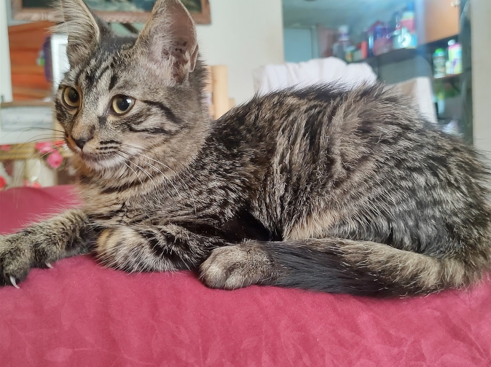

<!--
**JavierAPalaciosL/JavierAPalaciosL** is a ✨ _special_ ✨ repository because its `README.md` (this file) appears on your GitHub profile.

Here are some ideas to get you started:

- 🔭 I’m currently working on ...
- 🌱 I’m currently learning ...
- 👯 I’m looking to collaborate on ...
- 🤔 I’m looking for help with ...
- 💬 Ask me about ...
- 📫 How to reach me: ...
- 😄 Pronouns: ...
- ⚡ Fun fact: ...
-->

    <h1 align="center">I'm Javier Palacios</h1>

## About me

- ⭐ Engineer System Computer ⭐
- 📲 Backend Developer with framework spring boot Java and SQL
- 🧑‍🏫 Skills in data structure and algorithms
- ✏️ Development frontend with framework React and JavaScript vanilla
   

## My projects

<table>
  <tr>
    <td width="50%">
      <h3 align="center">Pacman using Java Swing and graph theory using Dijkstra's algorithm</h3>
      

        
        

          
          
        

        
Java Swing using <strong>Theory graphs</strong> - <strong>Algorithms</strong>.

      

    </td>
    <td width="50%">
      <h3 align="center">Morse code using Java Swing and binary tree</h3>
      

        
        

          
        

        
Java Swing using <strong>Binary tree</strong> - <strong>Algorithms</strong>.

      

    </td>
  </tr>

  <tr>
    <td width="50%">
      <h3 align="center">React and Spring Boot App consumming an API</h3>
    

      

This project use an API with Spring Boot and React with spring boot the api radio garden is consummed with RESTTEMPLATE and given to the frontend with JS and React for the design i use antd  https://ant.design/ and besides use a less css for move the components of antd

</td>
  </tr>

</table>
