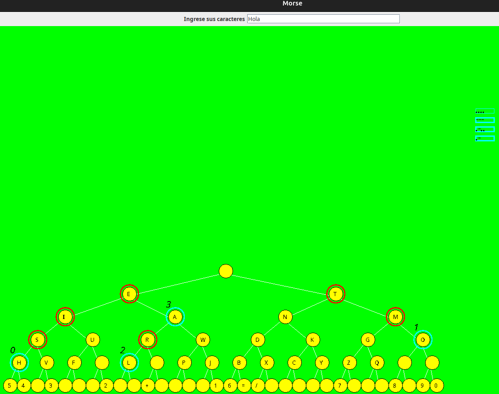

<!--
**JavierAPalaciosL/JavierAPalaciosL** is a ✨ _special_ ✨ repository because its `README.md` (this file) appears on your GitHub profile.

Here are some ideas to get you started:

- 🔭 I’m currently working on ...
- 🌱 I’m currently learning ...
- 👯 I’m looking to collaborate on ...
- 🤔 I’m looking for help with ...
- 💬 Ask me about ...
- 📫 How to reach me: ...
- 😄 Pronouns: ...
- ⚡ Fun fact: ...
-->

    <h1 align="center">I'm Javier Palacios</h1>

## About me

- ⭐ Engineer System Computer ⭐
- 📲 Backend Developer with framework spring boot Java and SQL
- 🧑‍🏫 Skills in data structure and algorithms
- ✏️ Development frontend with framework React and JavaScript vanilla
   

## My projects

<table>
  <tr>
    <td width="50%">
      <h3 align="center">Pacman using Java Swing and graph theory using Dijkstra's algorithm</h3>
      

        
        

          
          
        

        
Java Swing using <strong>Theory graphs</strong> - <strong>Algorithms</strong>.

      

    </td>
    <td width="50%">
      <h3 align="center">Morse code using Java Swing and binary tree</h3>
      

        
        

          
        

        
Java Swing using <strong>Binary tree</strong> - <strong>Algorithms</strong>.

      

    </td>
  </tr>
</table>
